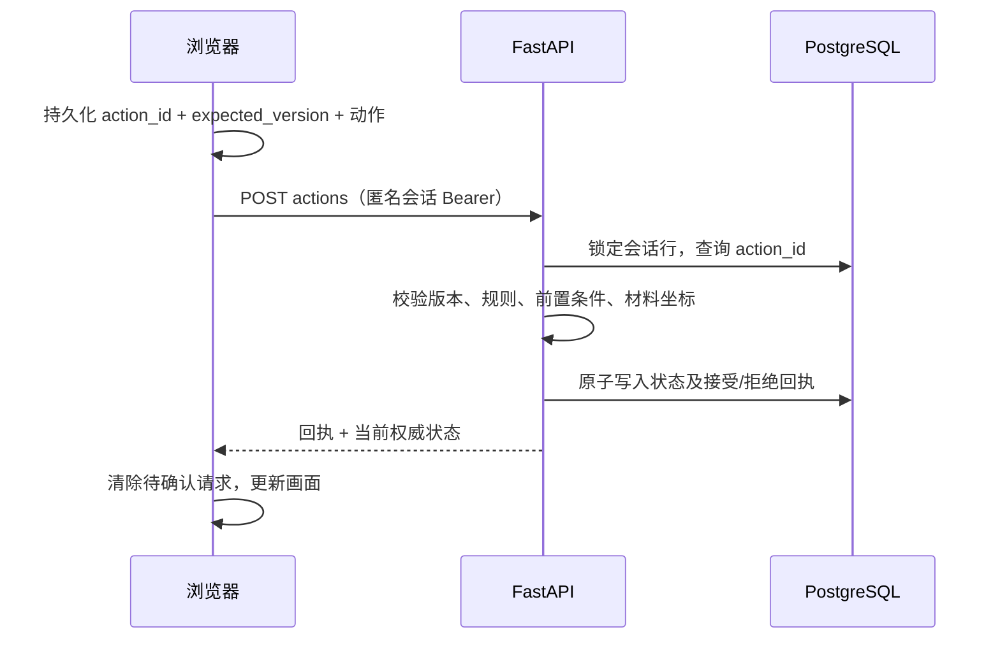

# L1 后端设计与当前实现

2026-09-27。本文件描述本次实现；完整 MVP 规划仍见 architecture.md / save-and-resume.md。

2026-09-28 增量：L2 已在同一匿名会话下接入，L1 接口、状态与事件保持兼容。数据库最新迁移为 `0002_l2`，新增独立 L2 表，ready 检查已相应更新。参见 [L2 后端与衔接](l2-backend.md)。

## 权威边界

浏览器只提交动作，不提交分数、通关标志、场景或计数。FastAPI 用数据库中的状态判定，接受后在同一事务内写入状态和事件回执。前端等响应后切换场景或播放修桥/船桨动画。拖拽、打开提示、关闭提示、减少动效是本地展示；有业务意义的选择和划桨才提交事件。



服务器不能证明现实中确实发生了鼠标拖动或真人点击；它校验客户端声明的动作/坐标是否合法，防止伪造通关状态及不合法顺序。此版本不作机器人检测，也不以客户端时间作为可信评分依据。

## 接口

| 方法/路径（/api/v1） | 功能 |
| --- | --- |
| GET /health | 进程健康与功能标志；persistence_ready=false，必须另查 ready |
| GET /ready | 检查数据库连接、两张业务表和 Alembic 版本 |
| POST /sessions | 新匿名会话，返回随机 token；数据库只存 token 的 SHA-256 |
| GET /sessions/{id} | 本人服务器状态 |
| POST /sessions/{id}/actions | 校验事件、写事务、返回状态与回执 |
| GET /sessions/{id}/events | 本会话接受/拒绝记录 |

除创建和健康检查外，必须携带 Authorization: Bearer token。错误凭据返回 404；所有响应 no-store。凭据只供同浏览器恢复，不是账号系统；清除浏览器存储后没有账号找回/跨设备恢复。不要分享 token。

动作请求例子（用自己的会话、UUID 和版本）：

```json
{"action_id":"7e45c336-98be-4e7b-a7f3-c2bf0ac2a28d","expected_version":0,"action":{"type":"choose","choice":"search","yes":true},"positions":{}}
```

200 + accepted=true 才表示成功；409 + accepted=false 返回拒绝原因和当前状态。422 是结构校验失败（未知 action、额外 state、非法坐标等），不会进业务事件表。权限失败也不入账。相同 action_id 与相同请求重试返回原回执及最新状态；同 ID 换内容返回 409。VERSION_CONFLICT 拒绝后需同步状态，下一次明确操作使用新 ID，不能悄悄重放成另一动作。

## 规则 v1

2026-09-29 新会话升级为 `l1-rules-v2-rope`，沿用下列过河规则并增加：

- `choose / take-rope / yes=true` 每次使 `state.ropeClicks` 增加 1，从 0 到 5；仅河岸、未划船、未修桥时有效。第六次拒绝。
- 第五次服务器确认后前端播放掉落动画，绳子回到原位置并可拖动。未拿下时禁止非零绳子位移，collect-wood / repair 也不能绕过拿取条件。
- GET 快照、事件重试和刷新均保留计数，现有 action_id 去重及 expected_version / 行锁继续生效。
- 兼容旧 `l1-rules-v1` 会话：缺少 ropeClicks 的旧状态按绳子已可用（5）读取，保留原版本和历史回执；下一次接受动作后持久化补齐字段。不重写历史，不需数据库结构迁移，不增加评分。体验新流程需重新开始旅程。
- 本次验证：L1 API 在隔离 PostgreSQL 数据库 14 项通过（含绳子并发）；前端 L1 18 项通过，类型检查和 Docker 生产构建通过；本地真实 API 的桌面/触屏模拟流程通过。未作真实设备或生产 UAT。

- 否也记录事件，但不改变道具/场景；可重新选择。关闭提示不是“否”。
- 修桥前两件材料的中心必须在场景矩形 x=760..1160、y=1060..1260。坐标是归一化位移，以现有 geometry.ts 为依据。collect-wood 与 repair 都在服务器检查材料位置；两步分别记账，第二步失败可重试。
- 修桥后才允许 cross-bridge。swim 与 use-ring 是独立路线。
- 第五次有效 search 获得船桨；有桨才允许 board；上船后只允许 paddle；第五次有效 paddle 到岸。
- 男、女招呼、拿灯、点灯独立。点灯可发生在拿灯之前，维持当前确认的交互规则。
- 岸边可直接 enter；完成后不再接受动作。每会话最多 1000 条接受事件。
- 不计算 A/V/T/F 正式分数；scoring_ready=false。规则版本固定在会话上；新旧版本兼容方式见上述增量说明。

## 数据、事务、恢复

- game_sessions：id、token_hash、rules_version、version、JSON state、JSON positions。
- game_events：联合主键(session_id, action_id)、原始请求、接受/拒绝回执、服务器 received_at。
- SELECT FOR UPDATE 串行化同一会话更新；状态和回执同一事务，唯一键防重复。不同会话独立。
- PostgreSQL named volume 保留重启后的进度；Alembic 0001_l1 建表。API 不自动 create_all，不在启动时悄悄改变数据库结构。
- 浏览器 SESSION_KEY 保存匿名凭据与上次快照；恢复时必须重新 GET 服务器状态，快照不能直接解锁关卡。旧预览存档保留但不导入。
- PENDING_KEY 保存单条待确认请求，发送前写入 localStorage。响应丢失后仍用原 ID/版本/内容重发。断线锁住业务操作；没有离线推进或多事件队列。这是当前 L1 的简化实现，完整 IndexedDB outbox 仍属后续工作。
- 道具摆放草稿仅本地保存，已接受动作附带的位置同时保存到服务器。草稿不会直接修桥，仍须服务器重新验证。
- 可在菜单的“开发预览记录”看到事件 ID、接受/拒绝、版本、规则；API 日志包含 session/action ID 与结果，不打印 token。

## 测试与运行边界

测试覆盖四条路线、第五次门槛、非法跳步、材料坐标、明确拒绝后重选、两个人物/灯、完成后拒绝、幂等重试、变更载荷、会话隔离、版本冲突与真实 PostgreSQL 并发。
前端测试覆盖响应丢失、同 ID 重试、服务器拒绝和草稿校验。Docker 的 ready 检查不是用户验收。

当前 Compose 仅绑定 localhost，供团队本地开发。公网部署前需另外补 TLS、部署密钥、限流/容量与数据保留策略、监控备份、依赖安全检查；不把此配置当生产发布完成。

参考：[Next.js rewrites](https://nextjs.org/docs/app/api-reference/config/next-config-js/rewrites)、[SQLAlchemy transactions](https://docs.sqlalchemy.org/en/20/core/connections.html)。
